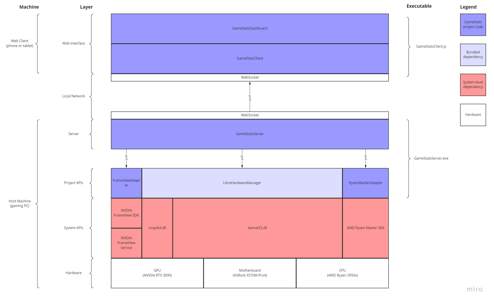

# GameStats

Presents a near-realtime stream of game-related performance telemetry in a pretty web interface.

There are plenty of excellent on-screen displays to monitor PC game performance ([RTSS](https://www.guru3d.com/files-details/rtss-rivatuner-statistics-server-download.html), [MSI Afterburner](https://www.msi.com/Landing/afterburner/graphics-cards), [FPS Monitor](https://www.fpsmon.com/), [NVIDIA FrameView](https://www.nvidia.com/en-us/geforce/technologies/frameview/), the XBox game overlay, etc), but none of these support a client/server setup where the telemetry is displayed on a separate device like a phone or dedicated tablet.

`GameStats` has two main components. The gaming PC runs a server process that captures performance data in realtime and publishes it as an event stream. A web client interprets this stream as a time-series dataset and presents it as a series of graphs in a dashboard.

## Goals

- **Low overhead:** Capturing data on the host machine should have negligible impact on game performance.
- **Low latency:** Metrics should appear in the dashboard as quickly as possible.
- **Accurate:** High-accuracy data sources are preferred, where available.
- **Granular:** Every relevant, available sensor should be published to the client. All aggregation/interpretation happens client-side.
- **Pretty:** Charts should be readable at a glance and updated frequently. Layouts should be optimized for phones, tablets, and desktop.

## Anti-goals
(i.e. "Do it later.")

- **Does not need to be configurable:** The layout and contents of the dashboard can be hardcoded.
- **Does not need to support a wide range of hardware:** Only the hardware that I personally use needs to be supported.
- **Does not need to be a self-contained installation:** It's ok to require the separate installation of third-party dependencies.
- **Does not need to be secure:** Unauthenticated access to the telemetry data is acceptable.

## Components

([source](https://miro.com/app/board/uXjVPb1sDKs=/))

### `GameStatsDashboard` (TypeScript)

Web dashboard frontend. Displays time-series data from the `GameStatsClient` as charts and graphs.

### `GameStatsClient` (TypeScript)

Establishes a connection to the event stream emitted by the `GameStatsServer` and collates it into a time-series dataset, which it presents to the `GameStatsDashboard`.

### `GameStatsServer` (C#)

Repeatedly polls each data source and publishes the results to the `GameStatsClient` as an event stream.

### `FrameViewAdapter` (C#)

Presents a C# interface for polling the NVIDIA FrameView SDK.

Metrics provided:
- Resolution
- Engine (e.g. OpenGL or DX 12)
- Frametime
- Render latency
- Input latency (calculated)
- Dropped frames

### `RyzenMasterAdapter` (C#)

Presents a C# interface for polling the Ryzen Master SDK.

Metrics provided:
- Per-core effective frequency (much more accurate than what's presented through LibreHardwareManager)
- Per-core [C0 state residency](https://www.dell.com/support/kbdoc/en-us/000060621/what-is-the-c-state)
- Values and limits for CPU voltage and power
- Memory timings
- Overclock mode (e.g. default, manual, PBO, auto)

### `LibreHardwareManager` (C#)

Open-source C# library for polling for system information.

Metrics provided:
- Motherboard
  - Voltages
  - Temperatures
  - Fan RPMs
  - Fan control speeds
- Memory
  - Physical memory used/available
  - Virtual memory used/available
- CPU
  - Per-core load
  - Per-core voltage
  - Per-core wattage
  - Total load
  - Package voltages
  - Package wattage
- GPU
  - Package power
  - Core, hotspot, and memory junction temperatures (potentially more if we improve LibreHardwareManager [like this one](https://github.com/LibreHardwareMonitor/LibreHardwareMonitor/pull/583))
  - Fan RPMs
  - Fan control speeds
  - PCIe Rx & Tx bandwidth
  - VRAM used/available
  - Load for:
    - Core
    - Memory controller
    - Video engine
    - Bus
    - Core GPU power
    - Board power
  - Disk I/O
  - Network I/O